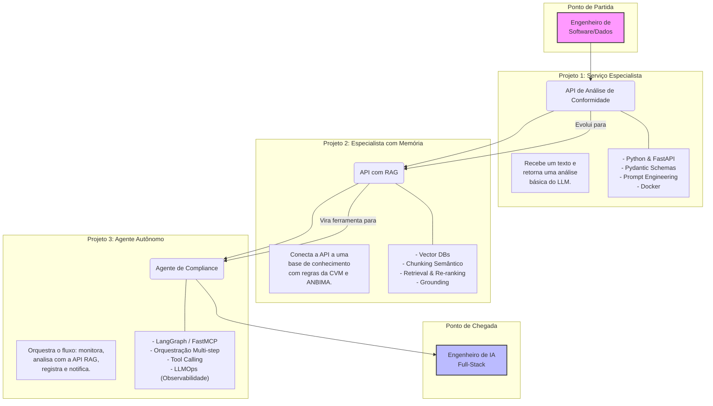

reni# Programa de Aprendizado – Engenheiro de IA 🤖

**IA Generativa, Agentes Inteligentes e Engenharia de Software para Produção**

## Visão Geral

Bem-vindo ao repositório do **Programa de Formação para Engenheiros de IA**. Nossa filosofia é simples: **não criamos protótipos, construímos soluções**. Este programa foi desenhado para preparar profissionais para atuar em desafios reais de IA generativa em ambiente corporativo, com foco em arquiteturas escaláveis, agentes inteligentes e engenharia de sistemas prontos para performar.

O objetivo é ir além do código, conectando decisões técnicas a um impacto de negócio mensurável.

## 🎯 Público-Alvo

Este programa é ideal para **engenheiros de software, dados ou back-end com experiência em Python** que desejam se especializar na construção de sistemas de IA generativa de ponta a ponta, desde a concepção até a preparação para o ambiente de produção.

## 💡 Nossa Metodologia: O Ciclo de Maestria em IA

Adotamos um ciclo de aprendizado ativo para garantir um desenvolvimento profundo e multifacetado.

-   **Aprender (Learn):** Focar nos conceitos teóricos com o suporte do nosso *Learning Path* e da documentação oficial. O objetivo é entender o "porquê" por trás de cada tecnologia.
-   **Construir (Build):** Aplicar o conhecimento na prática, desenvolvendo os três projetos principais. Aqui, a teoria se transforma em código funcional e soluções tangíveis.
-   **Apresentar (Present):** Criar artefatos que demonstrem o valor da solução, como a interface interativa com Streamlit. A capacidade de apresentar o trabalho é crucial.
-   **Defender (Defend):** Justificar as escolhas técnicas e de arquitetura nos documentos de decisão (`docs/decisions.md`). Esta é a habilidade de um engenheiro experiente: comunicar e defender suas soluções com base em fundamentos sólidos.

## 🎯 Cenário de Negócio: O Desafio do Compliance no Setor Financeiro

Este programa é construído em torno de um caso de uso real e de alto valor no setor financeiro (FSO - Financial Services Office): **a automação da análise de conformidade para recomendações de investimento**.

**A Dor:** Analistas de compliance são um recurso sênior e caro. Eles gastam um tempo enorme revisando manualmente as comunicações entre consultores de investimento e clientes para garantir que as recomendações estejam adequadas ao perfil de risco de cada investidor e sigam as regulamentações do mercado (CVM, ANBIMA). Este processo é:
- **Lento:** Atrasando a comunicação com o cliente.
- **Caro:** Utilizando horas de especialistas em tarefas repetitivas.
- **Sujeito a Falhas:** O cansaço e o volume podem levar a erros humanos.
- **Não Escalável:** É impossível revisar 100% das interações em tempo real.

**A Nossa Missão:** Construir uma solução de IA que evolui em três fases para resolver este problema, transformando um processo manual em um sistema inteligente e autônomo.

## 🚀 A Jornada do Engenheiro de IA: Do Serviço à Autonomia

Nossa metodologia é uma jornada progressiva. Cada projeto constrói sobre o anterior, culminando em uma solução completa e robusta.

## 🏅 O Perfil do Engenheiro de IA Moderno

Ao final do programa, o participante estará apto a atuar como um Engenheiro de IA completo, dominando habilidades técnicas e comportamentais.

### Hard Skills Desenvolvidas
- **Desenvolvimento de Backend:** Construção de APIs robustas com Python, FastAPI e Pydantic.
- **Arquitetura de IA:** Design e implementação de sistemas RAG, incluindo ingestão, indexação e recuperação otimizada.
- **Agentes Autônomos:** Orquestração de fluxos de trabalho complexos com LangGraph, gerenciamento de estado e uso de ferramentas.
- **Engenharia de Software:** Conteinerização com Docker, escrita de testes e documentação técnica.
- **LLMOps & Observabilidade:** Instrumentação de código para monitoramento de performance, custo e comportamento de sistemas de IA em produção.

### Soft Skills Essenciais
- **Resolução de Problemas:** Capacidade de traduzir uma dor de negócio em uma solução de IA viável e eficaz.
- **Pensamento Crítico:** Análise de trade-offs entre diferentes abordagens técnicas (ex: qual a melhor estratégia de chunking para este caso?).
- **Comunicação Técnica:** Habilidade de apresentar e defender decisões de arquitetura de forma clara e concisa.
- **Visão de Produto:** Foco em construir soluções que não apenas funcionam, mas que geram valor de negócio mensurável.

## 🗂️ Guia Rápido dos Projetos

Use a tabela abaixo para navegar diretamente para o guia de cada projeto.

| Fase do Programa | Objetivo do Projeto | Link Direto para o Guia |
| :--- | :--- | :--- |
| **Projeto 1** | Construir uma API REST com LLM | [**Guia do Projeto 1**](./projects/project-1/README.md) |
| **Projeto 2** | Adicionar uma base de conhecimento (RAG) | [**Guia do Projeto 2**](./projects/project-2/README.md) |
| **Projeto 3** | Automatizar o fluxo com um Agente | [**Guia do Projeto 3**](./projects/project-3/README.md) |

## 🚦 Como Começar a Desenvolver

1.  **Acesse a pasta do Projeto 1:** `cd projects/project-1`.
2.  **Siga as instruções** no `README.md` dentro da pasta para configurar o ambiente e começar a desenvolver.
3.  Ao concluir o Projeto 1, você continuará a evoluir o código que você mesmo criou para o Projeto 2, e assim por diante.

> **Dica:** A melhor abordagem é criar seu próprio repositório Git e copiar a estrutura de pastas de `projects/project-1` para lá. Assim, você constrói sua própria versão da solução do zero.

---

## 🔗 Recursos e Documentação (Learning Path)

### Documentação Oficial (Nossa Fonte da Verdade)
Para referências técnicas e detalhes de implementação, consulte sempre a documentação oficial:

- **Python:** [Documentação Oficial do Python 3](https://docs.python.org/3/)
- **FastAPI:** [Tutorial do FastAPI](https://fastapi.tiangolo.com/tutorial/) - Essencial para os Projetos 1 e 2.
- **Pydantic:** [Documentação do Pydantic V2](https://docs.pydantic.dev/latest/) - Fundamental para validação de dados.
- **Docker:** [Visão Geral do Docker](https://docs.docker.com/get-started/overview/)
- **LangChain:** [Documentação da LangChain para Python](https://python.langchain.com/docs/get_started/introduction) - Base para os Projetos 2 e 3.
- **LangGraph:** [Introdução ao LangGraph](https://langchain-ai.github.io/langgraph/) - O coração do nosso agente no Projeto 3.
- **Streamlit:** [Documentação do Streamlit](https://docs.streamlit.io/) - Para a criação da interface de demonstração.
- **OpenTelemetry:** [Documentação do OpenTelemetry](https://opentelemetry.io/docs/) - Para o desafio de observabilidade.

### Guias Conceituais e Tutoriais (Aprofundando o "Porquê")
Para entender os conceitos por trás das ferramentas, estes recursos são um ótimo ponto de partida:

- **Engenharia de Prompts:** [Guia de Engenharia de Prompt](https://www.promptingguide.ai/pt/introduction) - Um guia completo sobre técnicas de prompting, desde o básico até o avançado.
- **Arquitetura RAG:** [O que é RAG? (Pinecone)](https://www.pinecone.io/learn/retrieval-augmented-generation/) - Uma explicação clara e visual sobre o que é e por que usar a Geração Aumentada por Recuperação.
- **Bancos de Dados Vetoriais:** [O que é um Banco de Dados Vetorial? (Elastic)](https://www.elastic.co/what-is/vector-database) - Desmistifica o conceito de embeddings e bancos de dados vetoriais.
- **GitFlow e Versionamento:** [A Successful Git Branching Model](https://nvie.com/posts/a-successful-git-branching-model/) - O post clássico que introduziu o modelo GitFlow, essencial para trabalho em equipe.
- **Conventional Commits:** [Especificação do Conventional Commits](https://www.conventionalcommits.org/en/v1.0.0/) - Aprenda a escrever mensagens de commit claras e padronizadas.

